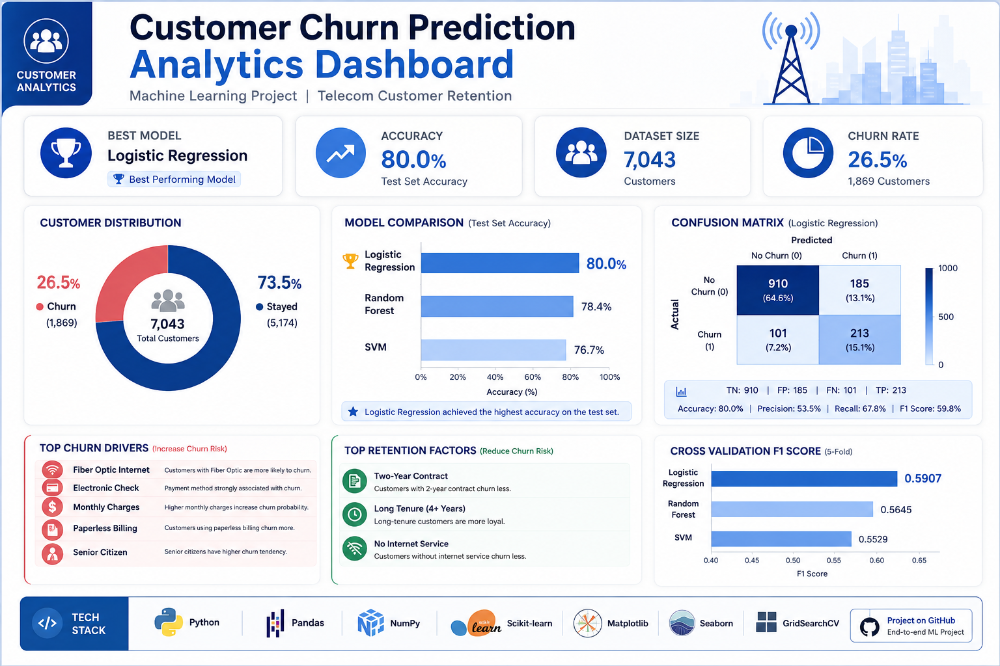

# 📊 Customer Churn Prediction using Machine Learning

A Machine Learning project that predicts customer churn in a telecommunications company using customer demographic and service data. The project includes data cleaning, exploratory data analysis (EDA), feature engineering, model training, evaluation, and business insights.

---

## 📌 Project Overview

Customer churn is one of the biggest challenges for telecommunications companies. Retaining existing customers is generally more cost-effective than acquiring new ones.

The objective of this project is to analyze customer behavior and build machine learning models that can predict whether a customer is likely to leave the company.

---




## 🎯 Objectives

- Understand customer behavior through data analysis.
- Clean and preprocess the dataset.
- Explore relationships between customer attributes and churn.
- Build and compare multiple machine learning models.
- Identify the most important factors affecting customer churn.
- Provide business recommendations based on the analysis.

---

## 📂 Dataset

**Dataset:** Telco Customer Churn Dataset

The dataset contains customer demographic information, subscribed services, billing information, and whether the customer left the company (Churn).

Target Variable:

- **Churn**
  - Yes
  - No

---

## 🛠️ Technologies Used

- Python
- Jupyter Notebook
- Pandas
- NumPy
- Matplotlib
- Seaborn
- Scikit-learn

---

## 📈 Project Workflow

1. Data Loading
2. Data Cleaning
3. Exploratory Data Analysis (EDA)
4. Feature Engineering
5. Data Preprocessing
6. Model Training
7. Model Evaluation
8. Business Insights

---

## 🤖 Machine Learning Models

The following classification models were implemented:

- Logistic Regression
- Random Forest Classifier
- Support Vector Machine (SVM)

Model performance was evaluated using:

- Accuracy
- Precision
- Recall
- F1-Score
- Confusion Matrix
- Cross Validation

---

## 💡 Key Insights

- Customers with shorter tenure are more likely to churn.
- Month-to-month contracts have the highest churn rate.
- Higher monthly charges are associated with increased churn.
- Contract type is one of the strongest predictors of customer churn.

---

## 🚀 Future Improvements

- Apply advanced boosting models such as XGBoost or LightGBM.
- Handle class imbalance using SMOTE.
- Perform hyperparameter optimization for additional models.
- Deploy the model as a web application.

---

## 📁 Repository Structure

```
Customer-Churn-Prediction/
│
├── Customer_Churn_Prediction.ipynb
├── Telco-Customer-Churn.csv
├── requirements.txt
├── README.md
└── images/
```

---

## 👨‍💻 Author

**Mohammed Eyad Algoul**

- GitHub: https://github.com/Mohammed-Algoul
- LinkedIn: https://www.linkedin.com/in/eng-mohammed-algoul/

---
⭐ If you found this project useful, consider giving it a star.
